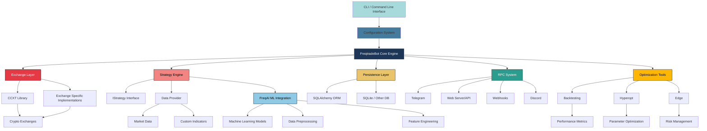

# Understanding the Freqtrade Architecture: A Deep Dive into the Free Crypto Trading Bot

Freqtrade is a powerful, open-source cryptocurrency trading bot written in Python that allows users to automate their trading strategies. With support for multiple exchanges and a wide range of features including backtesting, strategy optimization, and machine learning integration, freqtrade has become one of the most popular tools in the crypto trading community. In this article, we'll take a deep dive into the architecture of freqtrade to understand how it's built and how its components work together.

## Overview

Freqtrade is designed with a modular architecture that separates concerns into distinct components. This design allows for flexibility, extensibility, and maintainability. The core components include:

1. Configuration system
2. Exchange integration layer
3. Strategy engine
4. Data management system
5. Persistence layer
6. Trading execution engine
7. Optimization and backtesting modules
8. Remote procedure call (RPC) system
9. Machine learning integration (FreqAI)

## Component Hierarchy

1. **Entry Point**
- CLI / Command Line Interface: Entry point for all operations with various subcommands
2. **Configuration**
- Configuration System: Handles loading and validation of configuration from multiple sources
3. **Core Engine**
- FreqtradeBot Core Engine: Main orchestrator that ties all components together
4. **Core Components**
- **Exchange Layer**: Unified interface for interacting with various cryptocurrency exchanges

  - CCXT Library: Foundation library supporting 100+ exchanges
  - Exchange Specific Implementations: Customizations for specific exchange requirements
  - Crypto Exchanges: Actual exchange connections (Binance, Kraken, etc.)
- **Strategy Engine**: Executes user-defined trading strategies

  - IStrategy Interface: Defines the contract for all trading strategies
  - Data Provider: Supplies market data to strategies
    - Market Data: OHLCV and real-time data feeds
    - Custom Indicators: Technical indicators and custom metrics
  - FreqAI ML Integration: Machine learning capabilities for predictive modeling
    - Data Preprocessing: Data cleaning and normalization
    - Feature Engineering: Creating input features for models
    - Machine Learning Models: Predictive models for trading signals
- **Persistence Layer**: Manages all data persistence

  - SQLAlchemy ORM: Object-relational mapping for database operations
  - SQLite / Other DB: Storage backend for trade history, orders, and configuration
- **RPC System**: Handles all external communications

  - Telegram: Chat-based bot control and notifications
  - Web Server/API: REST API and web interface
  - Webhooks: HTTP callbacks for external integrations
  - Discord: Discord bot integration
- **Optimization Tools**: Strategy development and optimization utilities

  - Backtesting: Historical performance testing of strategies
    - Performance Metrics: Analysis of strategy results
  - Hyperopt: Automated parameter optimization
    - Parameter Optimization: Finding optimal strategy parameters
  - Edge: Risk analysis and position sizing tools
    - Risk Management: Capital allocation and risk controls

Let's explore each of these components in detail.

## Core Architecture Components

### 1. Configuration System

The configuration system is the foundation of freqtrade. Located in the `freqtrade/configuration` directory, it handles loading, parsing, and validating configuration files from various sources including JSON files, environment variables, and command-line arguments.

The main configuration class [Configuration](file://freqtrade-develop\freqtrade\configuration\configuration.py#L30-L514) in [configuration.py](file://freqtrade-develop\freqtrade\configuration\configuration.py) loads settings from multiple sources and merges them with the principle that later definitions override earlier ones. This system supports complex nested configurations and provides validation to ensure settings are correct before the bot starts.

Key features of the configuration system:
- Multi-source configuration loading (files, environment variables, CLI)
- Configuration validation and schema checking
- Support for secrets management
- Environment detection and adaptation

### 2. Exchange Integration Layer

The exchange layer (`freqtrade/exchange/`) provides a unified interface to interact with various cryptocurrency exchanges. Rather than directly integrating with each exchange's API, freqtrade uses the CCXT library as its foundation, which supports over 100 cryptocurrency exchanges.

The architecture includes:
- A base [Exchange](file://freqtrade-develop\freqtrade\exchange\exchange.py#L118-L3860) class that defines the common interface
- Exchange-specific implementations that extend the base class (e.g., [Binance](file://freqtrade-develop\freqtrade\exchange\binance.py#L28-L434), [Kraken](file://freqtrade-develop\freqtrade\exchange\kraken.py#L20-L205), `Bittrex`)
- Exchange utilities for common operations like price and amount precision handling
- WebSocket support for real-time data

This abstraction allows freqtrade to support many exchanges with minimal code duplication while maintaining exchange-specific functionality where needed.

### 3. Strategy Engine

At the heart of freqtrade is the strategy engine, which allows users to define their trading logic. Strategies are implemented as Python classes that inherit from the [IStrategy](file://freqtrade-develop\freqtrade\strategy\interface.py#L49-L1874) interface (`freqtrade/strategy/interface.py`).

Key components of the strategy engine:
- The [IStrategy](file://freqtrade-develop\freqtrade\strategy\interface.py#L49-L1874) abstract base class that defines the strategy interface
- Methods for generating entry and exit signals
- Support for technical indicators and custom data analysis
- Integration with the data provider for accessing market data
- Support for both long and short positions
- Customizable ROI (Return on Investment) and stoploss settings

The strategy system is designed to be highly flexible, allowing users to implement simple technical indicator-based strategies or complex machine learning models.

### 4. Data Management System

Freqtrade has a sophisticated data management system that handles various types of market data:

- OHLCV (Open, High, Low, Close, Volume) data
- Order book data
- Trade data
- Custom indicator data

The [DataProvider](file://freqtrade-develop\freqtrade\data\dataprovider.py#L38-L582) class (`freqtrade/data/dataprovider.py`) serves as the central point for strategies to access market data. It handles data caching, timeframe conversions, and provides both historical and real-time data access.

Key features include:
- Multiple timeframe support
- Data caching for performance
- Integration with external data sources
- Support for informative pairs (additional pairs used for context)

### 5. Persistence Layer

All trading state is persisted using SQLAlchemy ORM in the `freqtrade/persistence/` directory. This includes:

- Trade records
- Order history
- Pair locks
- Custom data storage
- Key-value store for configuration

The persistence layer uses SQLite as the default database but supports other SQL databases. It handles database migrations automatically and provides a clean interface for data access throughout the application.

### 6. Trading Execution Engine

The core trading logic is implemented in [FreqtradeBot](file://freqtrade-develop\freqtrade\freqtradebot.py#L72-L2608) class (`freqtrade/freqtradebot.py`). This component orchestrates all trading activities:

- Pair list management
- Trade entry and exit execution
- Position sizing
- Order management
- Risk management
- Trade lifecycle management

The bot operates in different modes:
- Live trading
- Dry-run mode (paper trading)
- Backtesting mode

### 7. Optimization and Backtesting Modules

Freqtrade includes powerful tools for strategy development and optimization:

**Backtesting System** (`freqtrade/optimize/backtesting.py`):
- Historical strategy testing
- Performance metrics calculation
- Trade analysis and reporting
- Customizable time range and pair selection

**Hyperopt** (`freqtrade/optimize/hyperopt/`):
- Automated parameter optimization
- Various optimization algorithms
- Customizable search spaces
- Parallel execution support

**Edge** (risk management):
- Dynamic stake amount calculation
- Win rate and expectancy analysis

### 8. Remote Procedure Call (RPC) System

The RPC system (`freqtrade/rpc/`) allows external control and monitoring of the bot:

- Telegram integration for notifications and commands
- Web UI for comprehensive management
- Web server API for programmatic access
- Webhook support for external integrations
- Discord notifications

The RPC manager coordinates all communication channels and ensures consistent messaging across different platforms.

### 9. Machine Learning Integration (FreqAI)

One of freqtrade's standout features is FreqAI (`freqtrade/freqai/`), which brings machine learning capabilities to trading strategies:

- Integration with popular ML libraries (scikit-learn, PyTorch)
- Data preprocessing and feature engineering pipelines
- Model training and prediction workflows
- Reinforcement learning support
- TensorBoard integration for model monitoring

The FreqAI interface allows strategies to incorporate predictive models while maintaining the familiar strategy structure.

## Command Line Interface

Freqtrade uses a command-line interface with subcommands for different operations:

- [trade](file://freqtrade-develop\freqtrade\rpc\api_server\api_v1.py#L211-L215): Main trading mode
- [backtesting](file://freqtrade-develop\freqtrade\optimize\backtesting.py#L0-L0): Historical strategy testing
- [hyperopt](file://freqtrade-develop\tests\optimize\conftest.py#L41-L43): Parameter optimization
- `edge`: Risk analysis
- `download-data`: Market data acquisition
- `plot-dataframe`: Strategy visualization
- [list-*](file://freqtrade-develop\docs\commands\list-data.md): Information listing commands

The argument parsing system (`freqtrade/commands/`) provides a consistent interface for all these operations.

## Data Flow Architecture

The typical data flow in freqtrade follows this pattern:

1. Configuration is loaded and validated
2. Exchange connection is established
3. Market data is fetched or loaded from storage
4. Strategy analyzes data and generates signals
5. Trading engine executes trades based on signals
6. Results are stored in the database
7. Information is communicated via RPC channels

This flow can be modified based on the operation mode (live trading, backtesting, etc.).

## Extensibility Points

Freqtrade is designed to be highly extensible:

- Custom strategies can be added without modifying core code
- New exchanges can be integrated through the exchange interface
- Additional RPC channels can be implemented
- Custom data sources can be integrated
- New hyperopt loss functions can be added
- Additional FreqAI models can be implemented

## Conclusion

Freqtrade's architecture demonstrates a well-thought-out approach to building a complex trading system. By separating concerns into distinct modules and providing clean interfaces between components, the project achieves:

1. **Maintainability**: Each component has a clear responsibility
2. **Extensibility**: New features can be added with minimal impact on existing code
3. **Testability**: Components can be tested in isolation
4. **Flexibility**: Users can customize behavior at multiple levels
5. **Reliability**: Clear separation of concerns reduces the chance of bugs

The modular design also allows developers to understand and contribute to specific parts of the system without needing to grasp the entire codebase at once. This has likely contributed to freqtrade's active community and continuous development.

Whether you're a trader looking to automate your strategies or a developer interested in algorithmic trading systems, understanding freqtrade's architecture provides valuable insights into how to build robust, scalable trading applications.

The project strikes an excellent balance between providing powerful features out of the box while maintaining an architecture that allows for customization and extension. This makes it suitable for both novice traders experimenting with algorithmic trading and experienced quants building sophisticated trading systems.
